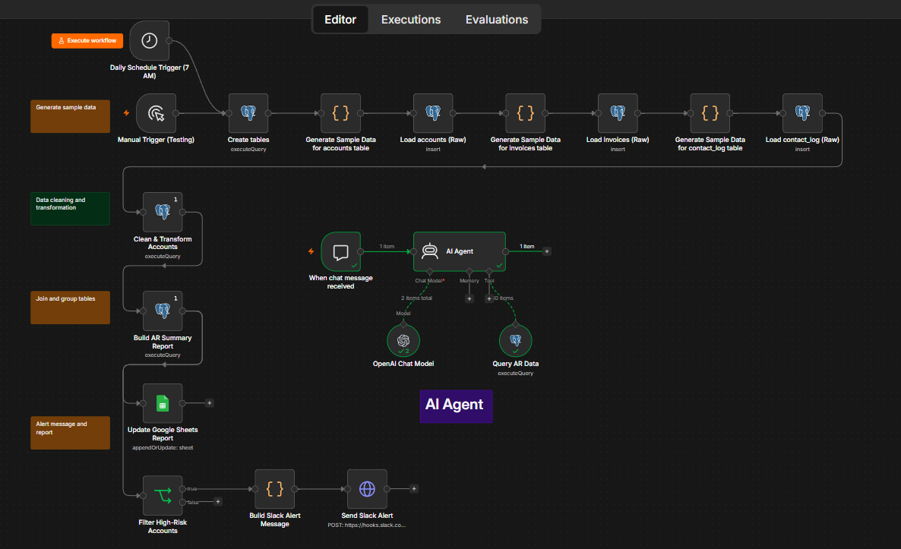
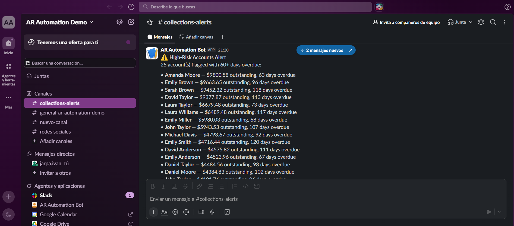
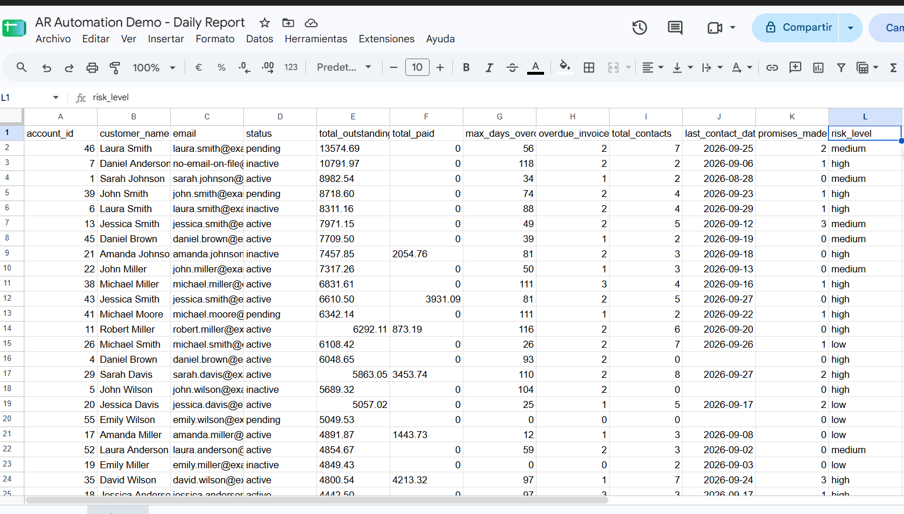
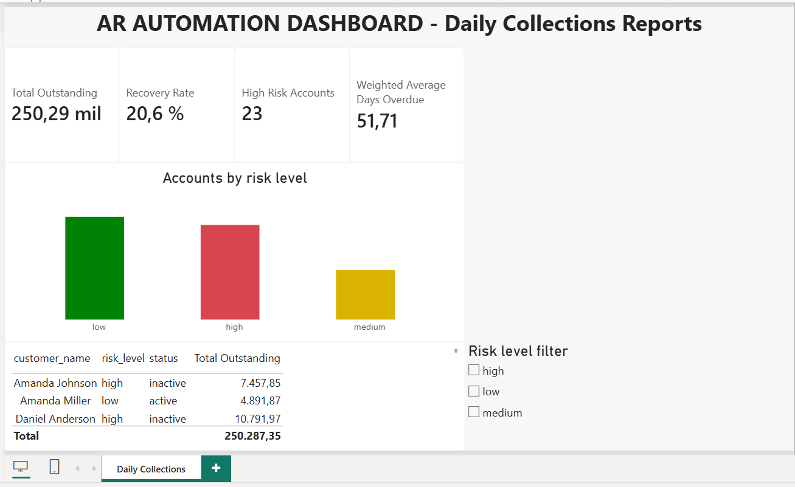
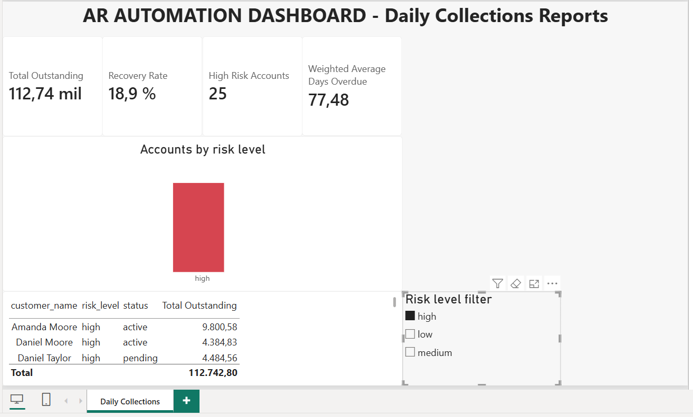
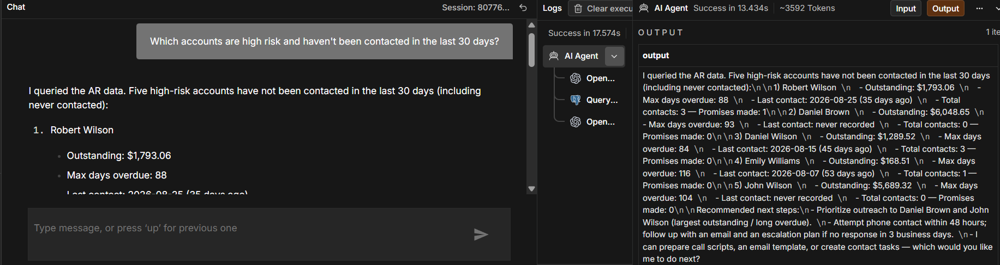
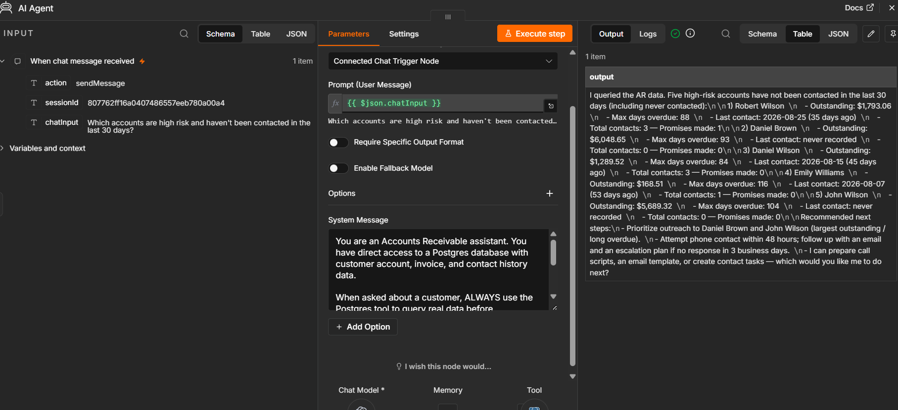
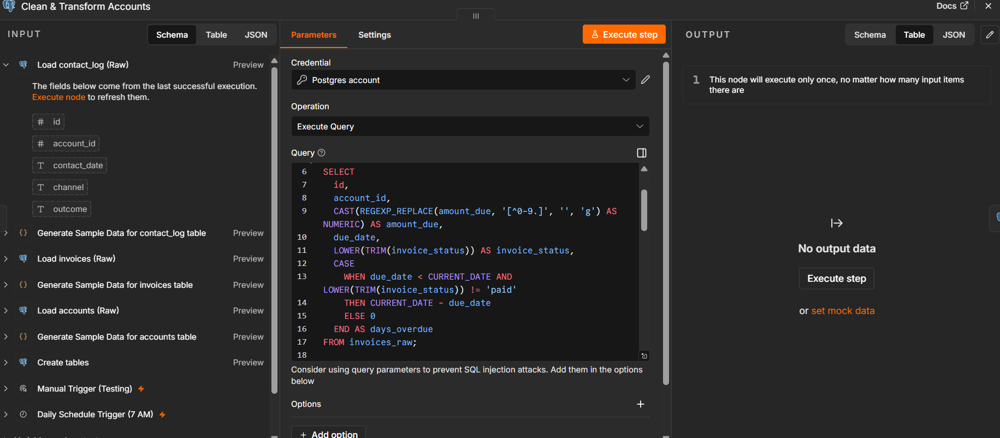
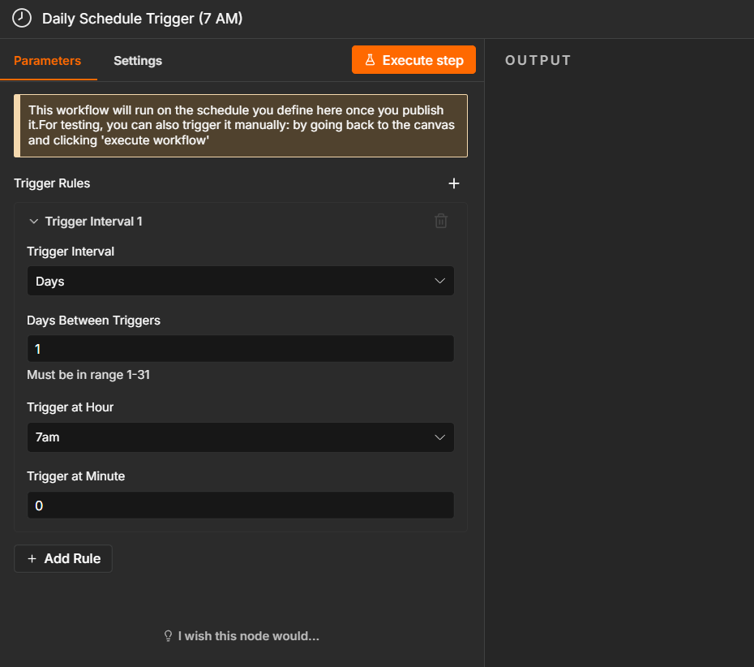
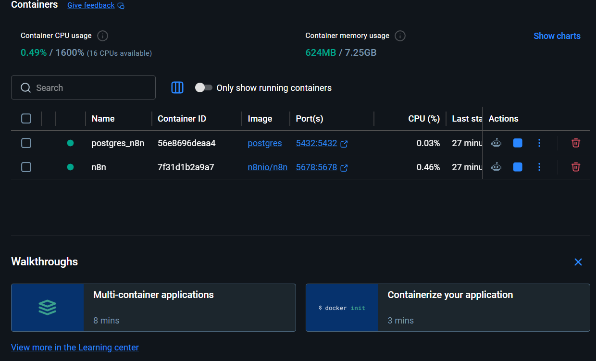

# AR Automation Demo

**A daily accounts-receivable pipeline that cleans messy data, flags high-risk accounts, alerts the collections team on Slack, updates a shared report, and lets anyone ask questions in plain English.**

Built with n8n, Postgres, Slack, Google Sheets, OpenAI and Power BI. Everything runs locally with one command.



---

## The business problem

Collections teams lose hours every morning doing the same things by hand:

- Exporting invoices and contact history from different systems
- Cleaning inconsistent data (mixed date formats, amounts stored as text like `$1,234.50 USD`, missing emails)
- Working out which accounts are actually at risk
- Telling the team who to call first
- Answering ad-hoc questions like *"who is high risk and hasn't been contacted in 30 days?"*

This project automates that whole loop. It comes from 10+ years of hands-on experience in collections and debt recovery, so the risk rules and the questions the assistant answers reflect how a real AR team works.

## What it does

Every morning at 7 AM (or on demand), the workflow:

1. **Loads** raw account, invoice and contact data into Postgres
2. **Cleans and standardizes** it through SQL views
3. **Classifies** each account as `high`, `medium` or `low` risk
4. **Builds** a per-account AR summary (outstanding, paid, days overdue, contact history)
5. **Posts** a Slack alert listing every high-risk account
6. **Updates** a Google Sheets report for the team
7. **Feeds** a Power BI dashboard connected to the same clean views

A separate branch exposes an **AI agent** that answers questions about the portfolio in natural language by querying the database live.

## Results

### Slack alert for high-risk accounts



### Daily report in Google Sheets



### Power BI dashboard

KPIs (Total Outstanding, Recovery Rate, High Risk Accounts, Weighted Average Days Overdue), accounts by risk level with semantic colors, a detail table and a risk-level slicer.





### Conversational AR assistant

Ask a question, get an answer grounded in the live data:



The agent is a chat model plus a Postgres tool that runs on demand, guided by a system prompt that defines its role as an AR assistant:



## Architecture

```
Schedule Trigger (7 AM) / Manual Trigger
  -> Create tables (raw)
  -> Generate + load accounts, invoices, contact_log
  -> Create clean views
  -> Build AR summary report
       -> Update Google Sheets
       -> Filter high-risk -> Build message -> Slack alert

Chat Trigger -> AI Agent (OpenAI + Postgres tool)

Power BI  <-  Postgres clean views
```

| Layer | Tool |
|---|---|
| Orchestration | n8n |
| Storage and transformation | PostgreSQL (raw tables + clean views) |
| Alerts | Slack (incoming webhook) |
| Team report | Google Sheets |
| Conversational layer | n8n AI Agent + OpenAI |
| Dashboard | Power BI (DAX measures) |
| Packaging | Docker Compose |

## Key design decisions

**Clean data lives in SQL views, not in copied tables.** Power BI and the AI agent always read fresh data, with no intermediate refresh step to break.



**Risk classification is defined once.** `risk_level` is calculated in the `accounts_clean` view (high > 60 days overdue, medium > 30, low otherwise). Slack, Sheets, Power BI and the AI agent all reuse the same definition instead of each reimplementing it.

**The dataset is realistic on purpose.** Synthetic data is generated from coherent business scenarios (paid, open, and low/medium/high risk invoices) rather than random dates and statuses, and it is deliberately dirty: mixed-case names, three date formats, amounts as text, about 5% missing emails.

**The AI agent gets the full picture and filters itself.** Instead of hard-coding filters in SQL, the agent receives the portfolio data and reasons over it, which keeps it resilient to typos in customer names.

**Power BI uses Import mode.** The scheduled run drops and recreates the raw tables each morning, and DirectQuery could fail if it queried mid-refresh.

**Scheduling is one node.**



## Quick start

**Requirements:** Docker Desktop, plus accounts for Slack (incoming webhook), Google Cloud (Sheets API OAuth) and OpenAI (API key).

1. Clone the repo
   ```bash
   git clone https://github.com/jarpaivan-wq/ar-automation-demo.git
   cd ar-automation-demo
   ```
2. Copy `.env.example` to `.env` and fill in your own values. The `.env` file is git-ignored and must never be committed.
3. Start the stack
   ```bash
   docker compose up -d
   ```
   Two containers come up: Postgres (port `5432`) and n8n (port `5678`). You can confirm they are running in Docker Desktop or with `docker ps`.

   
4. Open n8n at `http://localhost:5678` and create the owner account.
5. Import `n8n/workflow-export.json`.
6. Create the credentials the workflow needs: Postgres, Google Sheets (OAuth2) and OpenAI. Paste your Slack webhook URL into the `Send Slack Alert` node (the export contains a placeholder).
7. Click **Execute workflow**. Tables, views, the Slack alert and the Sheets report are created in one run.
8. Open the chat panel and ask the assistant a question.

## Project structure

```
ar-automation-demo/
├── docker-compose.yml
├── .env.example
├── n8n/
│   └── workflow-export.json
├── sql/
│   ├── create_tables.sql
│   ├── clean_and_transform.sql
│   └── build_ar_summary_report.sql
├── powerbi/
│   └── AR-Automation-Daily-Collections-Report.pbix
└── docs/
    └── screenshots/
```

## Power BI report

The `.pbix` file in `powerbi/` contains the full model: the three clean views, their relationships and the DAX measures (`Total Outstanding`, `Recovery Rate`, `Weighted Avg Days Overdue`, `High Risk Accounts`).

The file was saved with a snapshot of the synthetic data, and the workflow generates new random data on each run, so the numbers you see after refreshing will differ from the screenshots.

To connect it to your own instance:

1. Run the workflow at least once so the views exist.
2. Open the `.pbix` in Power BI Desktop.
3. Go to **Transform data > Data source settings** and point it to your Postgres (`localhost:5432` with the database and user from your `.env`).
4. Click **Refresh**.

## From demo to production

The synthetic-data nodes exist so anyone can run the project without real data. In a real engagement, they are replaced by ingestion from your source (ERP, CSV drops, API or database), and everything downstream (cleaning views, risk rules, alerts, report, dashboard, assistant) stays the same. Thresholds, channels and columns are adjusted to your policies.

## A note on how it was built

The code inside the n8n Code nodes was written with AI assistance. The design, the business rules, the SQL logic, the data model and the testing are mine, and I reviewed and validated every piece. Using AI as a copilot lets me deliver working automations faster, and this project is a small example of that approach.

## Need something like this?

I build automation and reporting pipelines for collections and accounts-receivable teams. Reach out on Upwork or LinkedIn: *(add your links here)*

## License

MIT
